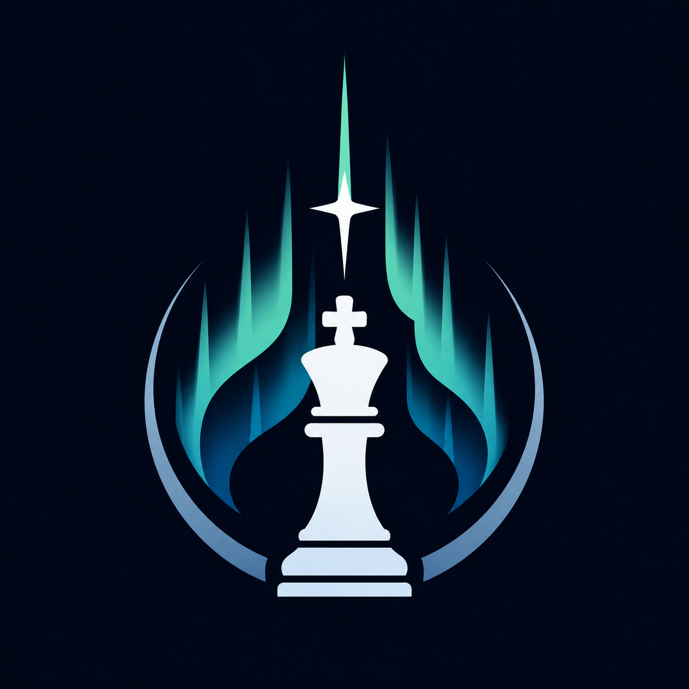

  

# Borealis chess engine

Borealis is a chess engine that is currently under development. At the moment, it's in very early stages.

This is a hobby project. I'm not looking to make money off it or make an extremely strong engine, but to increase my knowledge of C++ and of chess programming.

If you'd like to contribute, thanks for your interest! Frankly, this project isn't yet at a place where I'm looking for large-scale contributions, but that will change someday.

## Current status

- **Stage**: Adding bitboards, evaluation, and search.
- **Language**: C++ 17
- **Platforms**: Building on Windows 11

## Releases

- **July 2, 2026** — v0.1 — Ginnungagap
  Supports move generation; playing in CLI against an opponent who moves randomly.
